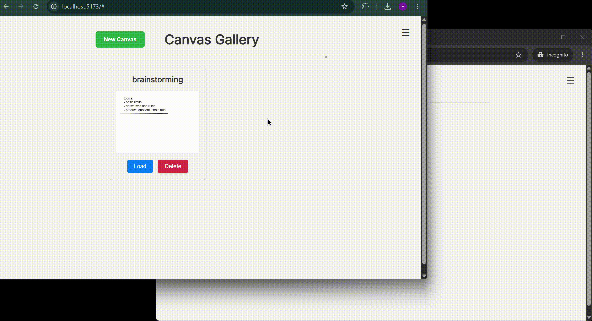

# Livedraw

Livedraw is a real-time collaborative drawing application built in React, Vite, Socket.IO and Supabase. Users can create canvases, save them to the cloud, share them with collaborators and draw together in real time. Designed as a full-stack project, Livedraw focuses on synchronizing shared state across multiple clients while maintaining secure and persistent data storage. 



## Features
- Real-time canvas synchronization through Socket.IO
- Freehand drawing, line, text and object selection tools
- Cloud-saved drawings managed in a gallery
- Google authentication through Supabase OAuth
- Role-based sharing (Owner, Editor, Viewer)
- Persistent storage using PostgreSQL in Supabase
- Responsive React interface through Konva

## Tech Stack

| Frontend | Backend | Database & Auth |
| --- | --- | --- |
| React, Vite, Konva | Node.js, Express, Socket.IO | Supabase PostgreSQL, Supabase Auth |

## Technical Highlights

This project focuses on building a responsive collaborative editing experience while keeping the system scalable and secure. Some key implementation details include: 

- Live synchronization using Socket.IO rooms
- Server-side authentication and permission checks before executing protected canvas operations
- Access control using different roles
- Clear separation between UI state and server application state

## Challenges

The primary learning curve in this project was utilizing an event-driven architecture with Socket.IO. Since real-time collaboration requires the client and server to continuously exchange events and maintain an accurate understanding of the canvas state, rethinking application logic and transforming user actions into broadcasted events was necessary. 

## Installation

```bash
git clone https://github.com/francis-chung/livedraw.git
cd livedraw

npm install
npm install --prefix client
npm install --prefix server

npm run dev
```

Configure the required Supabase environment variables for both the client and server before running the application. 

## Future Improvements

- Undo/redo history
- Keybind shortcuts
- Zooming and panning
- Additional drawing tools and shapes
- Mobile optimization

## License

This project is licensed under the [MIT](LICENSE) license. 
